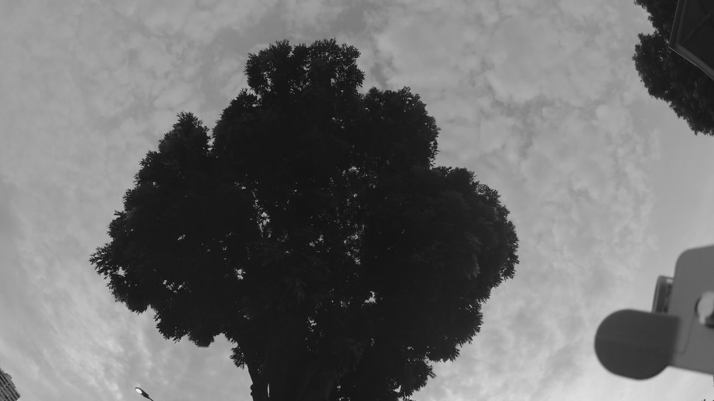
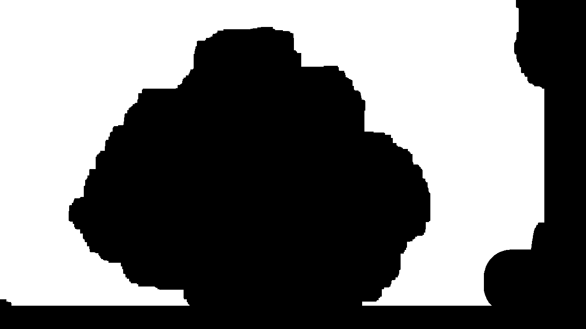
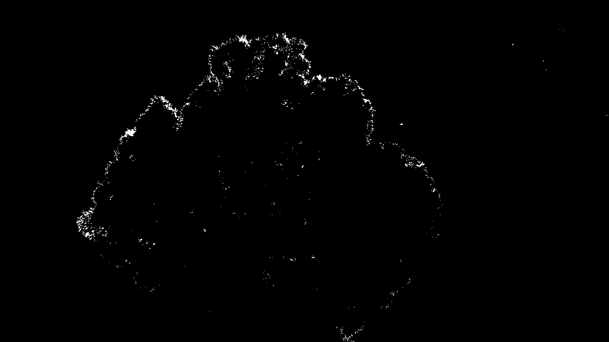
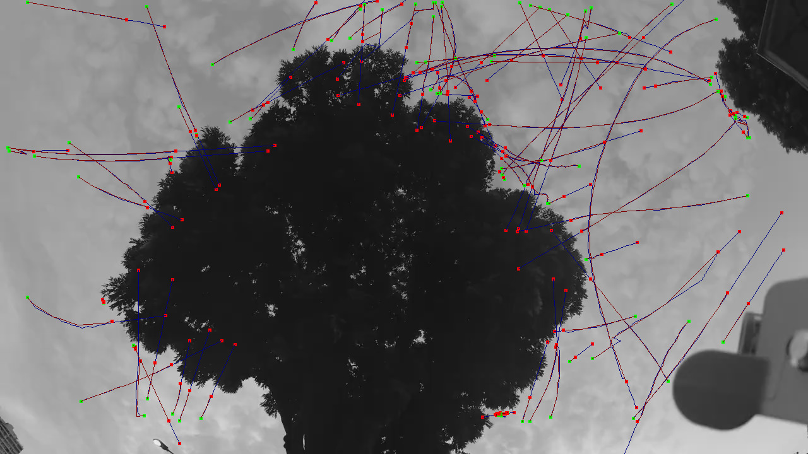

# BlobTracking

[](https://travis-ci.org/baggepinnen/BlobTracking.jl)
[](https://codecov.io/gh/baggepinnen/BlobTracking.jl)


Detect and track [blobs](https://en.wikipedia.org/wiki/Blob_detection) (like birds or bugs) moving around in an image. Blobs are detected using simple [Laplacian-of-Gaussian filtering](https://en.wikipedia.org/wiki/Blob_detection) (from [Images.jl](https://juliaimages.org/latest/function_reference/#Images.blob_LoG)) and tracked using a Kalman filter from [LowLevelParticleFilters.jl](https://github.com/baggepinnen/LowLevelParticleFilters.jl).

This package contains some facilities for the aforementioned detection and tracking, as well as some utilities for background removal etc.


## Usage
In the example below, we are tracking birds that fly around a tree.

### Load a video
```julia
using BlobTracking, Images, VideoIO
path = "/home/fredrikb/Video/2_small.MP4"
io   = VideoIO.open(path)
vid  = VideoIO.openvideo(io)
img  = first(vid)
```


*this package implements an iterator for VideoIO videos. It only iterates black and white images, even if the original video is in color.*

### Create a background image
We create a background image to subtract from each image
```julia
medbg = MedianBackground(Float32.(img), 4) # A buffer of 4 frames
foreach(1:4) do i # Populate the buffer
    update!(medbg,Float32.(first(vid)))
end
bg = background(medbg)
```


### Create a mask
If you want to detect birds (blobs) in the entire image, you can skip this step.

A mask is a binary image that is true where you want to be able to detect blobs and false where you want to ignore.
```julia
mask = (bg .> 0.4) |> reduce(∘, fill(erode, 30)) |> reduce(∘, fill(dilate, 20))
mask[:,1190:end] .= 0
mask[end-50:end,:] .= 0
```


### Preprocessing
For the tracking to work well, it's important that we feed the tracker nice and clean images. An example of a pre-processing function looks like this, it takes a storage array you can operate on in-place and the image to pre-process.
```julia
function preprocessor(storage, img)
    storage .= Float32.(img)
    update!(medbg, storage) # update the background model
    storage .= Float32.(abs.(storage .- background(medbg)) .> 0.4) # You can save some computation by not calculating a new background image every sample
end
```

Notice how the tree contours are still present in this image? This is okay since that is behind the mask we created above. The mask was created by dilating the tree slightly so that the mask covers slightly more than the tree. However, in this image you can also see two small spots to the right of the tree, representing birds.

### Run tracking
We now create the `BlobTracker` and run the tracking. If we don't know an appropriate value for the `sizes` vector that determines the size scales of the blobs, we may call the function `tune_sizes` to get a small GUI with a slider to help us out (works in Juno and IJulia). The length of `sizes` has a large impact on the time it takes to process each frame since the majority of the processing time is taken up by the blob detection.
```julia
bt = BlobTracker(sizes=3:3,
                mask=mask,
                preprocessor = preprocessor,
                amplitude_th = 0.05,
                correspondence = HungarianCorrespondence(p=1.0, dist_th=2), # dist_th is the number of sigmas away from a predicted location a measurement is accepted.
                σw = 2.0, # Dynamics noise std.
                σe = 10.0)  # Measurement noise std. (pixels)
tune_sizes(bt, img)

result = track_blobs(bt, vid,
                         display = Base.display, # use nothing to omit displaying.
                         recorder = Recorder()) # records result to video on disk
```
To display images in a standalone window with okay performance, consider
```julia
using ImageView
c = imshow(img)
displayfun = img -> imshow!(c["gui"]["canvas"],img);
track_blobs(...; display = displayfun)
```
Blobs are shown in blue, newly spawned blobs are show in green and measurements are shown in red.If everything is working well, most blue dots should have a red dot inside or very nearby. If the blue blobs are lagging behind the red dots, the filter needs tuning by either decreasing the measurement variance or increasing the dynamics variance. If blue dots shoot off rapidly whenever measurements are lost, the dynamics variance should be decreased.


### Visualization etc.

```julia
traces = trace(result, minlife=5) # Filter minimum lifetime of 5
measurement_traces = tracem(result, minlife=5)
drawimg = RGB.(img)
draw!(drawimg, traces, c=RGB(0,0,0.5))
draw!(drawimg, measurement_traces, c=RGB(0.5,0,0))
```


In the image, green dots represent spawning positions and red dots the last obtained measurement for a blob in case of the red measurement traces, and the point at which the blob was killed in case of the blue location traces.

Below is a youtube video showing how it looks
[](https://www.youtube.com/watch?v=uKAURHYEWRs)

## Further documentation
Most functions have docstrings. Docstrings of types hint at what functions you can call on instances of the type. The types present in this package are
- `Blob` represents a Blob, contains traces of locations and measurements as well as the Kalman filter
- `BlobTracker` contains parameters for the tracking and correspondence matching
- `AbstractCorrespondence`
    - `HungarianCorrespondence` matches blobs to measurements using the Hungarian algorithm
    - `NearestNeighborCorrespondence` matches blobs to the nearest measurement
- `TrackingResult` contains lists of dead and alive blobs
- `Trace` is a list of coordinates
- `Recorder` records movies and saves them on disk
- `FrameBuffer` stores frames for temporal processing
- `BackgroundExtractor`
    - `MedianBackground` models the background of an image
    - `DiffBackground` models the background of an image
- `Workspace` is used internally
